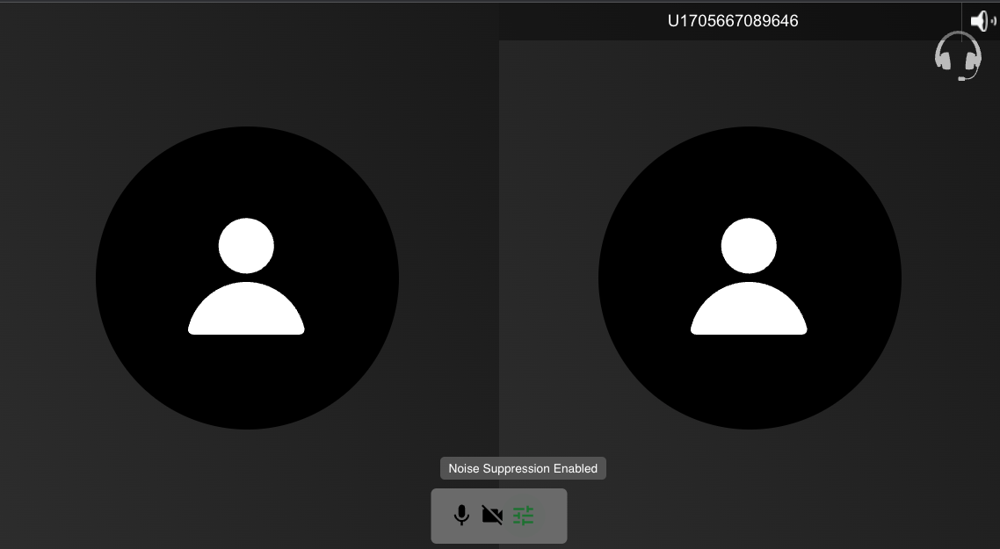

# video-noise-suppression-react

A simple react app with "opentok/client" and "@vonage/noise-suppression".

It has a button to enable/disable the noise suppression processor for the local publisher's audio.

The local publisher is initialised withtout connecting to any audio processor.
After it is initialised, you can click that button to toggle the noise suppression processor.

## Install

- `npm install`
- `cp env.example to .env`, and add your credentials there.

## Available Scripts

In the project directory, you can run:

### `npm run server`
Start server, a simple sever that uses one opentok session only, just a sample

### `npm start`

Open [http://localhost:3000](http://localhost:3000) to view it in your browser.

### Click that button to toggle the noise suppression processor

